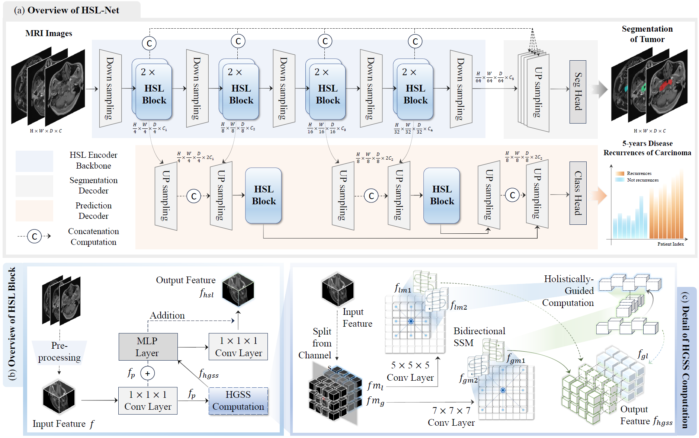

# Holistically Guided State Space Magnetic Resonance Imaging Analysis for Nasopharyngeal Carcinoma: Data, Method and Evaluation

### All data and code of this project will be open source after the paper is accepted.

## Data1: GCNC 2025
### Some sample samples can be obtained from this [Link](https://drive.google.com/drive/folders/15jBTXuG8FpnnN6I_ZnZGIgYwzk7dJhRC?usp=sharing).


## Data2: FS-NPC
### This assistance dataset can be obtained from this [Link](https://zenodo.org/records/13131827).


## Methodology: Overview of HSL-Net



## Get project
```
git clone git@github.com:JeMing-creater/HSL-Net.git
```

## Requirements
```
# Requirements
cd requirements
pip install -r requirements.txt

# Mamba
cd Mamba/causal-conv1d
python setup.py install
cd Mamba/mamba
python setup.py install
# Mamba sample setting
# Find the mamba_sample.py file and replace it with requirements\mamba_sample.py

```